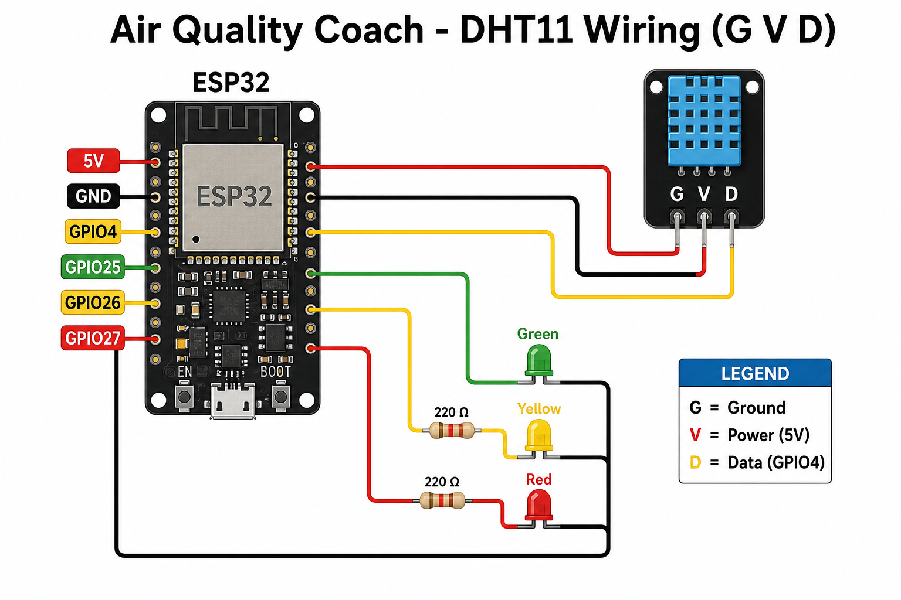

# Air Quality Coach: Open the Window

ESP32 + **DHT11 (G / V / D)** + traffic-light LEDs + SoftAP phone page.

When humidity gets high, the red LED lights and your phone says **OPEN THE WINDOW**.

Built for **LaunchPoint 2026 IoT Club Showcase**.

---

## Phone login (SoftAP hotspot)

You must join the ESP32 hotspot to open the page. Your phone may say "No internet". That is normal.

| Item | Value |
|------|-------|
| **Wi-Fi name (SSID / login)** | `AirCoach` |
| **Password** | `openwindow` |
| **Phone page URL** | [http://192.168.4.1/](http://192.168.4.1/) |
| **JSON data URL** | [http://192.168.4.1/json](http://192.168.4.1/json) |

Steps:
1. On your phone, open Wi-Fi settings
2. Connect to **AirCoach**
3. Enter password **openwindow**
4. Open a browser and go to **http://192.168.4.1/**

These values are set in `air_quality_coach.ino` as `AP_SSID` and `AP_PASS`.

---

## Wiring (DHT11 module with G / V / D)

Your module has **3 pins labeled G, V, D** (not S / + / -).



| Sensor pin | Meaning | Connect to ESP32 |
|------------|---------|------------------|
| **G** | Ground | **GND** |
| **V** | Power | **5V** (or 3V3 if needed) |
| **D** | Data | **GPIO4** |

```text
DHT11          ESP32
-----          -----
G   ---------> GND
V   ---------> 5V
D   ---------> GPIO4
```

| LED | ESP32 GPIO | Resistor |
|-----|------------|----------|
| Green | 25 | 220Ω |
| Yellow | 26 | 220Ω |
| Red | 27 | 220Ω |

LED: long leg to resistor side; short leg to GND.

---

## Quick start

1. Wire as above (unplug USB first)
2. Arduino IDE: Board **ESP32 Dev Module**, Port `/dev/ttyUSB0`
3. Install **DHT sensor library** (Adafruit) + **Adafruit Unified Sensor**
4. Open `air_quality_coach.ino` and Upload
5. Serial Monitor at **115200** should show `SoftAP started`
6. Phone Wi-Fi: **AirCoach** / **openwindow**
7. Browser: [http://192.168.4.1](http://192.168.4.1)
8. Breathe on the DHT11: yellow/red + "OPEN THE WINDOW"

Guides:
- Build walkthrough: [`STEP_BY_STEP_KY015.md`](STEP_BY_STEP_KY015.md)
- Full code explanation: [`CODE_EXPLAINED.md`](CODE_EXPLAINED.md)

---

## How it works

1. DHT11 reads temperature + humidity every 2.5 seconds
2. Thresholds:
   - **&lt; 55%** green / Air OK
   - **55-70%** yellow / Getting stuffy
   - **≥ 70%** red / OPEN THE WINDOW
3. ESP32 SoftAP serves a live HTML page (and `/json`). No home router required

---

## Files

| File | Purpose |
|------|---------|
| `air_quality_coach.ino` | ESP32 firmware |
| `CODE_EXPLAINED.md` | Full explanation of the code |
| `dht11-gvd-wiring-diagram.png` | Correct G/V/D wiring diagram |
| `STEP_BY_STEP_KY015.md` | Detailed build guide |
| `sketch.yaml` | Arduino IDE 2 ESP32 profile |
| `README.md` | This file |

---

## Hardware

- ESP32 (Freenove / DevKit)
- DHT11 module with pins **G V D**
- 3 LEDs + 220Ω resistors
- Breadboard + jumper wires

---

## License

MIT. Free to use and adapt for demos and teaching.
